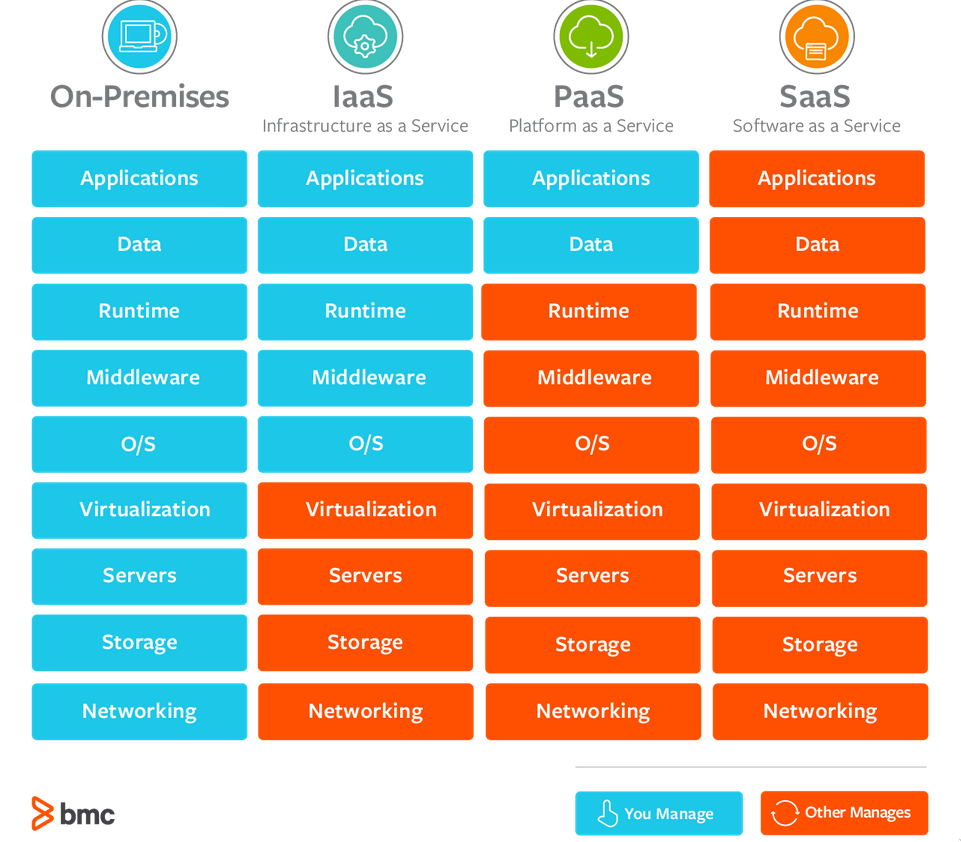

# DevOps

## Why Use DevOps? - Benefits To The Business

DevOps bridges the gap between the historically isolated development and operations teams. Some benefits to the business are shown below:

* Shorter development cycles
*  Reduce implementation failures, reflections and recovery time
*  Better communication and cooperation between teams
*  Reduce Costs

## Tools Of DevOps

* Configuration Management:
	* Ansible
	* Puppet
	* Chef
* Monitoring:
	* Grafana
	* Prometheus
	* Nagios
* Cloud computing:
	* AWS SSS, EC2 etc.
	* GCP
	* DigitalOcean Droplets
	* Hetzner

## Cloud Computing

## SAAS, PAAS, And IAAS

* SAAS (Software as a Service):
	* Form of cloud computing that delivers a cloud application, with all its underlying IT infrastructure and platforms to users. Service provider manages application all the way to the O/S and networking.
* IAAS (Infrastructure as a Service):
	* Provides virtualisation, storage, network and servers. One can essentially rent all of this so that the customer doesn't have to worry about setting up their in infrastructure.
* PAAS (Platform as a Service):
	* Essentially same as IAAS the service provider manages everything but data and applications.

See image below to understand the differences between them.

### When Should We Use Each Of Them?

## On Premises, Hybrid and Public Clouds

* On Premises:
	* Server is on their own property
* Hybrid:
	* A mixture of on premises and in the public cloud .e.g. using servers on premises for crunching high intensity calculations, with an instance in the public cloud on AWS as a back up for data
* Public Cloud:
	* A 'server' that you can rent time and space on, everything is on this.

